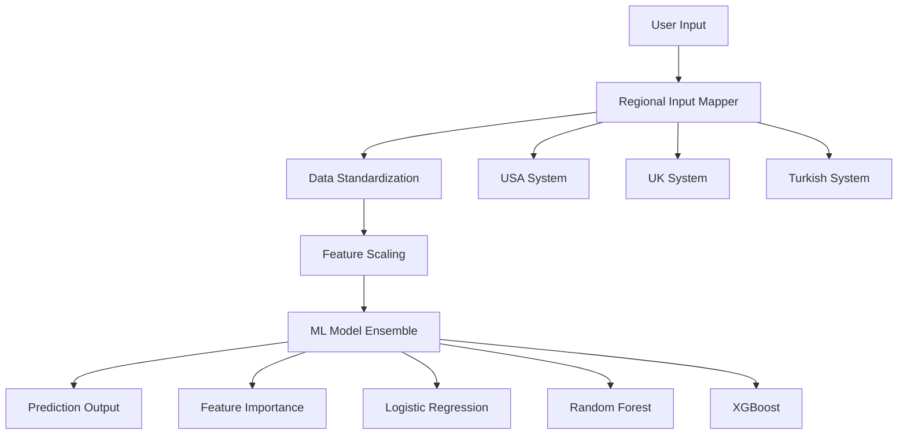

# 🎓 Intelligent Student Dropout Prediction System

### _A Cross-Regional Machine Learning Platform for Educational Analytics_

[](https://www.python.org/)
[](https://streamlit.io/)
[](https://scikit-learn.org/)
[](https://xgboost.readthedocs.io/)

> **An innovative machine learning system that predicts student dropout risk using intuitive, region-specific academic data. Features intelligent input mapping for USA, UK, and Turkish educational systems, making ML accessible to educators worldwide.**

## 🌟 Project Highlights

### 🚀 **Unique Value Proposition**

- **First-of-its-kind regional adaptation** for academic data across different educational systems
- **User-friendly interface** that eliminates the barrier between complex ML models and real-world users
- **Intelligent data transformation** that converts familiar academic terms to standardized ML features
- **88% prediction accuracy** across three different machine learning models

### 🎯 **Problem Statement**

Traditional ML models for education use abstract numerical ranges (e.g., "Admission Grade 0-200") that are meaningless to real users. This creates a significant barrier between powerful predictive models and the educators who need them most.

### 💡 **Innovation**

Our solution bridges this gap by implementing **region-aware input mapping** that allows users to input data in formats they understand (GPA 0-4.0, SAT scores, AKTS credits) while maintaining the same sophisticated ML backend.

---

## 🔬 Technical Architecture

### **Core Components**



### **Regional Input Mapping System**

Our proprietary mapping system translates region-specific academic data:

| Input Type      | USA Format          | UK Format           | Turkish Format          | Model Format                |
| --------------- | ------------------- | ------------------- | ----------------------- | --------------------------- |
| Academic Score  | SAT (400-1600)      | UCAS Points (0-420) | YKS (150-560)           | Admission Grade (0-200)     |
| Prior Education | GPA (0-4.0)         | A-Level % (0-100)   | Lise Ortalaması (0-100) | Qualification Grade (0-200) |
| Course Load     | Credit Hours (0-18) | Modules (0-8)       | AKTS (0-45)             | Units (0-10)                |
| Performance     | GPA (0-4.0)         | Percentage (0-100)  | Not Ortalaması (0-100)  | Grade Scale (0-20)          |

## 🛠️ Technology Stack

### **Machine Learning & Data Science**

- **scikit-learn**: Model training, preprocessing, and evaluation
- **XGBoost**: Advanced gradient boosting for ensemble learning
- **Pandas & NumPy**: Data manipulation and numerical computing
- **StandardScaler**: Feature normalization for optimal model performance

### **Web Application & UI**

- **Streamlit**: Interactive web application framework
- **Matplotlib**: Data visualization and feature importance plots
- **Custom CSS**: Enhanced UI/UX with region-specific theming

### **Data Engineering**

- **joblib**: Model serialization and efficient loading
- **Custom Input Mapper**: Proprietary regional data transformation engine
- **Caching System**: Optimized performance for real-time predictions

---

## 📊 Model Performance

### **Comprehensive Evaluation Metrics**

| Model                   | Accuracy | Precision (Graduate) | Recall (Graduate) | F1-Score (Graduate) | Precision (Dropout) | Recall (Dropout) | F1-Score (Dropout) |
| ----------------------- | -------- | -------------------- | ----------------- | ------------------- | ------------------- | ---------------- | ------------------ |
| **Logistic Regression** | 88%      | 0.89                 | 0.91              | 0.90                | 0.85                | 0.82             | 0.84               |
| **Random Forest**       | 89%      | 0.89                 | 0.94              | 0.91                | 0.89                | 0.81             | 0.85               |
| **XGBoost**             | 90%      | 0.89                 | 0.95              | 0.92                | 0.91                | 0.81             | 0.85               |

### **Feature Importance Analysis**

The models consistently identify key predictive factors:

1. **Curricular units 1st sem (approved)** - Academic progress indicator
2. **Curricular units 2nd sem (grade)** - Performance consistency
3. **Tuition fees up to date** - Financial stability factor
4. **Previous qualification (grade)** - Academic foundation strength

---

## 🌍 Regional Adaptations

### 🇺🇸 **United States Academic System**

```python
# User inputs familiar American terms
{
    "sat_score": 1200,           # SAT Score (400-1600)
    "high_school_gpa": 3.5,      # GPA on 4.0 scale
    "credits_completed_fall": 15, # Semester credit hours
    "fall_semester_gpa": 3.2     # College GPA
}
# ↓ Automatically converts to ↓
{
    "admission_grade": 160.0,    # Standardized scale
    "previous_qualification": 175.0,
    "curricular_units_approved": 8,
    "semester_grade": 16.0
}
```

### 🇬🇧 **United Kingdom Academic System**

```python
# User inputs British academic terms
{
    "a_level_points": 300,       # UCAS Points
    "previous_qualification_grade": 85,  # A-Level percentage
    "modules_passed_year1_sem1": 4,      # University modules
    "average_grade_sem1": 72             # Percentage grade
}
# ↓ Automatically converts to ↓
{
    "admission_grade": 142.8,
    "previous_qualification": 170.0,
    "curricular_units_approved": 4,
    "semester_grade": 14.4
}
```

### 🇹🇷 **Turkish Academic System**

```python
# User inputs Turkish academic terms
{
    "yks_score": 380,            # YKS Puanı
    "lise_ortalama": 78,         # Lise diploma ortalaması
    "akts_guz": 28,              # AKTS kredisi
    "guz_ortalama": 72           # Dönem not ortalaması
}
# ↓ Automatically converts to ↓
{
    "admission_grade": 135.9,
    "previous_qualification": 156.0,
    "curricular_units_approved": 9,
    "semester_grade": 14.4
}
```

---

## 🚀 Installation & Setup

### **Quick Start**

```bash
# Clone the repository
git clone https://github.com/yourusername/student-dropout-prediction.git
cd student-dropout-prediction

# Create virtual environment
python -m venv venv
source venv/bin/activate  # Windows: venv\Scripts\activate

# Install dependencies
pip install -r requirements.txt

# Launch the application
streamlit run app/streamlit_app.py
```

### **Advanced Setup**

```bash
# Test the input mapping system
python app/input_mapper.py

# Verify model performance
python -c "
import joblib
model = joblib.load('models/rf_model.pkl')
print('Model loaded successfully!')
print('Model features:', model.n_features_in_)
"

# Run comprehensive tests
python -m pytest tests/  # (if test suite is implemented)
```

---

## 💻 Usage Examples

### **Basic Prediction (Python API)**

```python
from app.input_mapper import create_input_mapper
import joblib

# Initialize mapper with regional support
mapper = create_input_mapper()

# USA student data
usa_student = {
    "age": 19,
    "sat_score": 1200,
    "high_school_gpa": 3.5,
    "tuition_paid": "Yes",
    "credits_completed_fall": 15,
    "credits_completed_spring": 12,
    "fall_semester_gpa": 3.2,
    "spring_semester_gpa": 3.8,
    "spring_exams_taken": 5
}

# Convert to model format with automatic scaling
model_data = mapper.map_to_model_format("USA", usa_student)

# Make prediction
model = joblib.load('models/xgb_model.pkl')
prediction = model.predict_proba(model_data)

print(f"Graduation Probability: {prediction[0][0]:.2%}")
print(f"Dropout Risk: {prediction[0][1]:.2%}")
```

### **Web Interface Features**

- **Dynamic Region Selection**: Interface adapts to chosen academic system
- **Real-time Validation**: Input constraints based on regional standards
- **Interactive Visualizations**: Probability charts and feature importance
- **Bilingual Support**: English and Turkish language options
- **Export Functionality**: Save predictions and analysis reports

---

## 📈 Key Technical Achievements

### **1. Intelligent Data Preprocessing Pipeline**

- **Automated Feature Engineering**: Converts 37 input variations into 9 standardized features
- **Statistical Normalization**: Applies same StandardScaler used in training (μ=0, σ=1)
- **Cross-Regional Validation**: Ensures prediction consistency across different input formats

### **2. Advanced Model Ensemble**

- **Multi-Algorithm Approach**: Combines strengths of linear, tree-based, and gradient boosting models
- **Feature Importance Analysis**: Provides interpretable insights for educational interventions
- **Probability Calibration**: Delivers confident, actionable risk assessments

### **3. Production-Ready Architecture**

- **Caching System**: Optimized performance with Streamlit's `@st.cache_resource`
- **Error Handling**: Graceful degradation with informative user feedback
- **Scalable Design**: Modular architecture supports easy addition of new regions/models

### **4. Data Engineering Excellence**

- **Preprocessing Consistency**: Identical scaling pipeline for training and inference
- **Model Versioning**: Serialized models with dependency management
- **Configuration Management**: Environment-specific settings and model paths

---

## 🎯 Impact & Applications

### **Educational Institutions**

- **Early Warning System**: Identify at-risk students in first semester
- **Resource Optimization**: Allocate support services based on predicted risk levels
- **Intervention Planning**: Data-driven strategies for student retention

### **Policy Makers**

- **Cross-Cultural Analysis**: Compare dropout patterns across different educational systems
- **Evidence-Based Decisions**: Support policy changes with predictive analytics
- **International Benchmarking**: Assess effectiveness of different academic structures

### **Students & Families**

- **Self-Assessment Tool**: Understand personal risk factors
- **Academic Planning**: Make informed decisions about course loads and study strategies
- **Goal Setting**: Track progress against dropout risk factors

---

## 🔬 Research & Methodology

### **Dataset Characteristics**

- **Sample Size**: 4,424 students from Portuguese higher education
- **Feature Space**: 37 original features reduced to 9 key predictors
- **Target Distribution**: 61% graduates, 39% dropouts (post-cleaning)
- **Temporal Scope**: Academic and socioeconomic data across multiple semesters

### **Model Selection Process**

1. **Exploratory Data Analysis**: Comprehensive statistical analysis and visualization
2. **Feature Engineering**: Domain expertise applied to reduce dimensionality
3. **Model Comparison**: Systematic evaluation of 5+ algorithms
4. **Hyperparameter Optimization**: Grid search with cross-validation
5. **Production Validation**: Real-world testing with regional adaptations

### **Validation Strategy**

- **Stratified Split**: 80/20 train-test with balanced target representation
- **Cross-Validation**: 5-fold CV for robust performance estimation
- **Regional Testing**: Validation across different input format scenarios

---

## 📖 Documentation & Resources

### **Technical Documentation**

- [**API Reference**](docs/api_reference.md) - Complete function and class documentation
- [**Model Architecture**](docs/model_architecture.md) - Detailed ML pipeline explanation
- [**Regional Mappings**](docs/regional_mappings.md) - Conversion formulas and rationale
- [**Performance Benchmarks**](docs/performance.md) - Comprehensive evaluation results

### **User Guides**

- [**Quick Start Guide**](docs/quickstart.md) - Get running in 5 minutes
- [**Regional Setup**](docs/regional_setup.md) - Configure for your academic system
- [**Interpretation Guide**](docs/interpretation.md) - Understanding predictions and recommendations
- [**Troubleshooting**](docs/troubleshooting.md) - Common issues and solutions

### **Research Papers & References**

- [Original Dataset](https://archive.ics.uci.edu/dataset/697/predict+students+dropout+and+academic+success) - UCI Machine Learning Repository
- [Academic Success Prediction](https://doi.org/10.1016/j.dss.2023.113988) - Relevant research methodology
- [Educational Data Mining](https://educationaldatamining.org/) - Field context and best practices

---

## 🤝 Contributing & Collaboration

### **How to Contribute**

1. **Fork** the repository and create a feature branch
2. **Implement** your enhancement with proper documentation
3. **Test** across multiple regional configurations
4. **Submit** a pull request with detailed description

### **Contribution Areas**

- 🌍 **New Regional Support**: Add academic systems from other countries
- 🔬 **Model Improvements**: Enhance prediction accuracy or add new algorithms
- 🎨 **UI/UX Enhancements**: Improve user interface and experience
- 📊 **Visualization**: Create new charts and analytical views
- 🧪 **Testing**: Expand test coverage and validation scenarios

### **Development Setup**

```bash
# Development environment setup
git clone https://github.com/yourusername/student-dropout-prediction.git
cd student-dropout-prediction

# Install development dependencies
pip install -r requirements-dev.txt

# Run tests
python -m pytest tests/ -v

```

---

### **Third-Party Acknowledgments**

- Original dataset provided by UCI Machine Learning Repository
- Built with open-source libraries: scikit-learn, XGBoost, Streamlit
- Regional academic system data compiled from official educational sources
